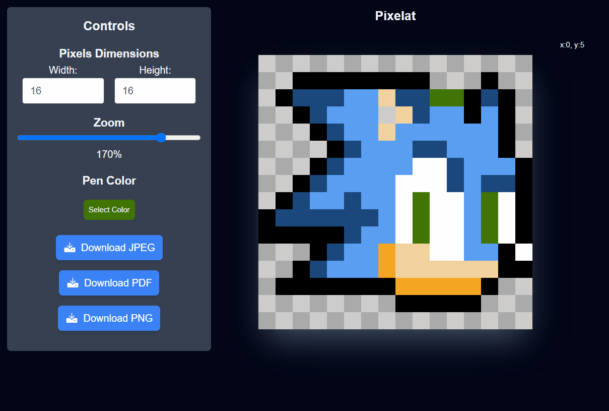

# Pixelat

[](https://pixelat.vercel.app/)

This is a simple pixel art editor built using ReactJS, Tailwind CSS, and TypeScript. It allows users to create pixel art designs easily.

## Features

- **Intuitive Interface**: The editor provides a user-friendly interface for creating pixel art designs.
- **Responsive Design**: Built with responsive design principles, ensuring usability across various devices.
- **Export**: Export your pixel art designs in popular formats such as PNG or JPEG.
- **Color Picker**: Select colors from a wide range of options to paint your pixels.

## Demo

Check out the live demo [here](https://pixelat.vercel.app/) to explore the editor's functionality.

## Installation

To run this project locally, follow these steps:

1. Clone the repository:

   ```bash
   git clone https://github.com/fuadit/pixelat.git
   ```

2. Navigate to the project directory:

   ```bash
   cd pixelat
   ```

3. Install dependencies:

   ```bash
   npm install
   ```

4. Start the development server:

   ```bash
   npm run dev
   ```
5. Open your browser and go to http://localhost:3000 to see the editor in action.

## Usage

- **Creating a Pixel Art**: Click on individual pixels to color them. Use the color picker to select different colors.
- **Undo/Redo**: Use the right and left mouse clicks on the work area to make actions.
- **Exporting Artwork**: Once you're satisfied with your design, use the export feature to save it in PNG or JPEG format.

## Contributing

Contributions are welcome! If you encounter any bugs or have suggestions for improvements, please feel free to open an issue or submit a pull request.

## License

This project is licensed under the [MIT License](https://opensource.org/licenses/MIT).
